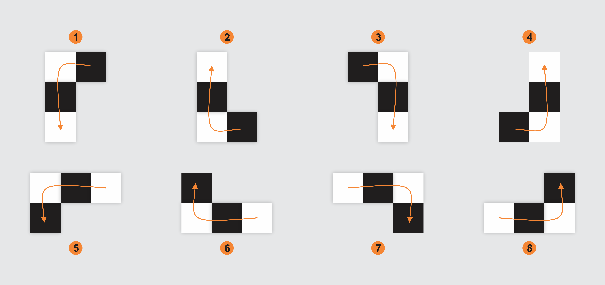

# **Knight's tour**


## Como executar este projeto

Para **compilar e executar** o Knight's Tour, execute o arquivo `build.bat`, presente na raíz do projeto.

Para **somente executar** o Knight's Tour, execute o arquivo `main.exe`, presente na pasta `build`.

Caso seja necessário especificar a localização do `g++.exe`, você pode passá-lo como argumento na execução do arquivo `build.bat`, como é mostrado abaixo.

```bash
build.bat "C:\Program Files\CodeBlocks\MinGW\bin\g++.exe"
```


## Rotações do cavalo

As rotações do cavalo são ponderadas iniciando pelas rotações verticais, como mostra a imagem abaixo.




## Desempenho em um tabuleiro 5x6

### Bruteforce
||0|1|2|3|4|5|
|---|---|---|---|---|---|---|
|**0**|115|3500|239|720|4260|19|
|**1**|2420|1862|6444|2602|2408|1953|
|**2**|31732|26573|244|722|16581|32244|
|**3**|14968|8372|22463|19004|9543|12845|
|**4**|1252|13789|1351|172|14858|2626|
Total bruteforce time [ms]: 255927

### Weighted
||0|1|2|3|4|5|
|---|---|---|---|---|---|---|
|**0**|685|2623|237|40|4307|11893|
|**1**|1770|0|1985|14|42|117|
|**2**|2|12479|64|821|352|21|
|**3**|1792|0|19505|10590|41|97|
|**4**|97|350|33|39|707|0|
Total weighted time [ms]: 70743
